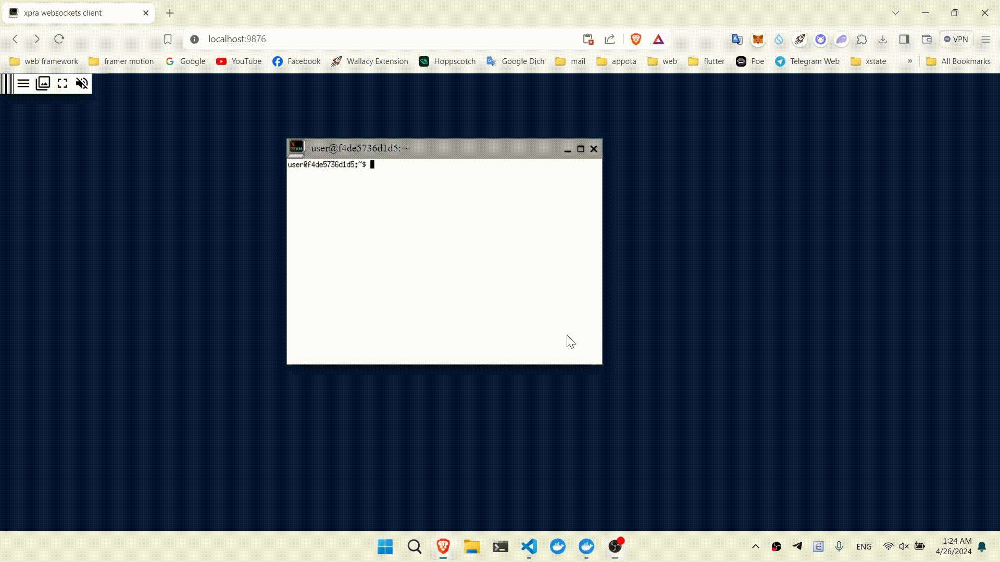

**BUILD** 
`docker build -t xpra/demo:1.0 .` 
**RUN** 
`sudo docker run --name xpra-demo -p 9876:9876 -d xpra/demo:1.0` 
**RUN IN BROWSER** 
Connect to http://localhost:9876 in browser to view xeyes window 
**DEMO IN BROWSER** 

